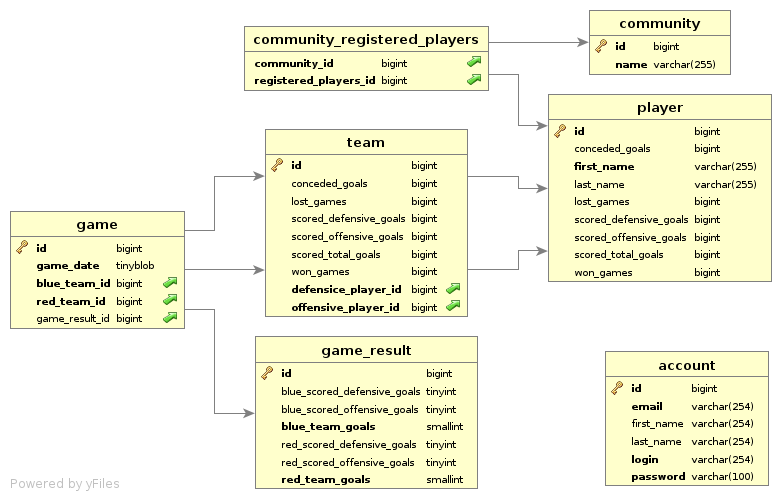

fluke goal / Glückstor
======================

An application to track your table soccer score.

Build and run
-------------

*Prerequisite:*
* Install Maven 3.x.
* Install Java 8.
* Install and start a MySQL or MariaDB server.
* Create an empty database _fluke_.

*Clone project:*
```bash
git clone ssh://git@git.verinice.org:7999/rd/fluke-goal.git
cd fluke-goal
```
Set your MySQL / MariaDB connection properties in class _fluke-goal-rest/src/main/resources/application.properties_

*Build project:*
```bash
export JAVA_HOME=/path/to/jdk-8
mvn package [-DskipTests]
```

*Start REST service:*
```bash
java -jar fluke-goal-rest/target/fluke-goal-rest-0.1.0-SNAPSHOT.jar
```

*Start Vaadin GUI:*

Since the REST service is running on port 8080 by default you have to set
another port for the Vaadin GUI:
```bash
java -Dserver.port=8090 -jar fluke-goal-vaadin-gui/target/fluke-goal-vaadin-gui-0.1.0-SNAPSHOT.jar
```
* Open a browser and go to: http://localhost:8090/
* Click _Register_ to create an account.

Test REST service
-----------------

Use the account created with the vaadin GUI for _NAME_ and _PASSWORD_.

Add a player:
```bash
curl -u NAME:PASSWORD -d '{  "firstName" : "Frodo",  "lastName" : "Baggins" }' \
-i -X POST -H "Content-Type:application/json" \
 http://localhost:8080/service/player
```
Get all player:
```bash
curl -u NAME:PASSWORD http://localhost:8080/service/player
```

Get a single player by id:
```bash
curl -u NAME:PASSWORD http://localhost:8080/service/player/1
```

Database
--------

Entity–relationship model of the fuke database:


